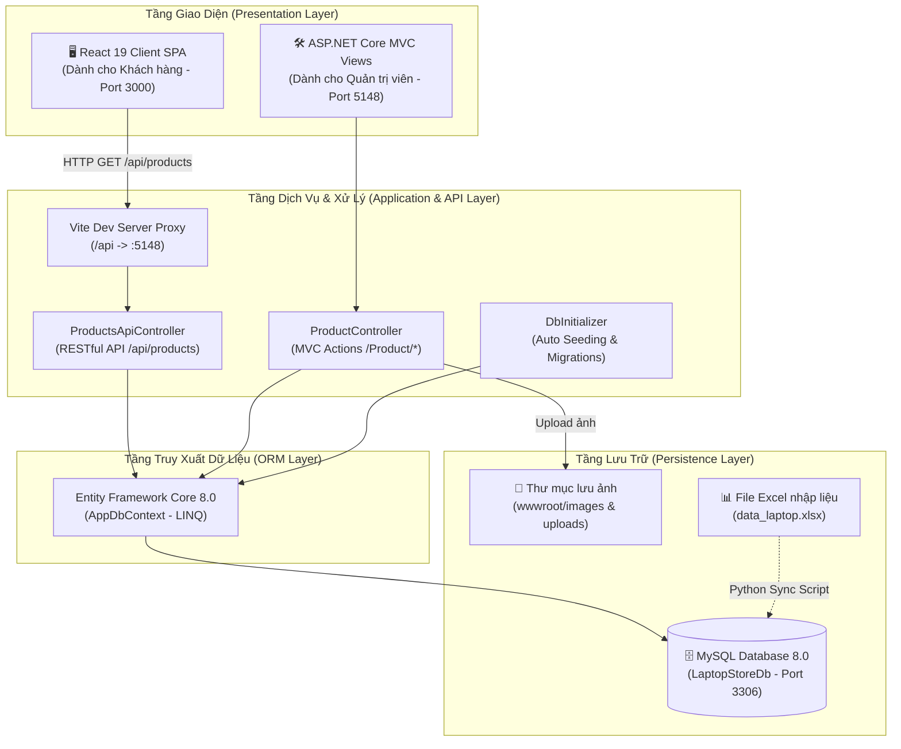

# 📖 TÀI LIỆU KỸ THUẬT HỆ THỐNG LAPTOP STORE
> **Phiên bản tài liệu**: 1.0.0  
> **Dự án**: Hệ thống Website Thương mại điện tử Bán lẻ Laptop (Laptop Store)  
> **Kiến trúc**: Full-stack RESTful Web API (ASP.NET Core 8.0) + Single Page Application (React 19) + Relational Database (MySQL 8.0).

---

## 📑 MỤC LỤC
1. [Giới thiệu tổng quan](#1-giới-thiệu-tổng-quan)
2. [Kiến trúc hệ thống (System Architecture)](#2-kiến-trúc-hệ-thống-system-architecture)
3. [Ngăn xếp công nghệ (Technology Stack)](#3-ngăn-xếp-công-nghệ-technology-stack)
4. [Thiết kế cơ sở dữ liệu (Database Design & ERD)](#4-thiết-kế-cơ-sở-dữ-liệu-database-design--erd)
5. [Chi tiết các phân hệ chức năng](#5-chi-tiết-các-phân-hệ-chức-năng)
   - [5.1. Phân hệ Khách hàng (Client - React SPA)](#51-phân-hệ-khách-hàng-client---react-spa)
   - [5.2. Phân hệ Quản trị (Admin - ASP.NET Core MVC)](#52-phân-hệ-quản-trị-admin---aspnet-core-mvc)
   - [5.3. Phân hệ Web API (RESTful Endpoints)](#53-phân-hệ-web-api-restful-endpoints)
   - [5.4. Phân hệ Tiện ích Đồng bộ Dữ liệu (Excel Sync)](#54-phân-hệ-tiện-ích-đồng-bộ-dữ-liệu-excel-sync)
6. [Luồng hoạt động chính của hệ thống (Workflows)](#6-luồng-hoạt-động-chính-của-hệ-thống-workflows)
7. [Cấu trúc mã nguồn (Codebase Structure)](#7-cấu-trúc-mã-nguồn-codebase-structure)
8. [Hướng dẫn cài đặt và vận hành](#8-hướng-dẫn-cài-đặt-và-vận-hành)

---

## 1. GIỚI THIỆU TỔNG QUAN

### 1.1. Bối cảnh & Mục tiêu
**Laptop Store** là hệ thống phần mềm web hoàn chỉnh phục vụ kinh doanh bán lẻ máy tính xách tay. Hệ thống được xây dựng nhằm giải quyết 2 bài toán cốt lõi:
1. **Trải nghiệm khách hàng**: Cung cấp giao diện trực quan, tải nhanh (Single Page Application), cho phép tìm kiếm và lọc máy tính tức thì theo nhiều tiêu chí kỹ thuật phức tạp (Hãng, CPU, Dung lượng RAM, Ổ cứng, Kích thước màn hình, Khoảng giá) mà không phải tải lại toàn bộ trang web.
2. **Quản trị vận hành**: Cung cấp công cụ quản trị (Admin Dashboard) để nhập liệu, cập nhật giá bán, kiểm soát kho hàng và hỗ trợ nạp dữ liệu hàng loạt từ file bảng tính Excel một cách tự động.

---

## 2. KIẾN TRÚC HỆ THỐNG (SYSTEM ARCHITECTURE)

Hệ thống được thiết kế theo mô hình **Tách biệt Frontend - Backend (Decoupled Full-Stack Architecture)**, tích hợp đồng thời 2 giao diện phục vụ 2 nhóm người dùng khác nhau:



---

## 3. NGĂN XẾP CÔNG NGHỆ (TECHNOLOGY STACK)

| Thành phần | Công nghệ sử dụng | Phiên bản | Vai trò trong hệ thống |
| :--- | :--- | :--- | :--- |
| **Frontend Web** | React | 19.x | Xây dựng giao diện tương tác khách hàng dạng Single Page App (SPA) |
| **Bundler / Dev Server** | Vite | 6.x / 8.x | Đóng gói mã nguồn Frontend, Hot Module Reload (HMR), Reverse Proxy API |
| **Icons & UI Utility** | Bootstrap & Bootstrap Icons | 5.3.x | Hệ thống lưới Responsive (Grid System) và bộ icon giao diện |
| **Backend Framework** | ASP.NET Core | 8.0 LTS | Xây dựng RESTful Web API và ứng dụng Web MVC quản trị |
| **ORM / Data Access** | Entity Framework Core | 8.0.x (Pomelo MySQL) | Ánh xạ đối tượng C# với các bảng cơ sở dữ liệu quan hệ (Object-Relational Mapping) |
| **Database Engine** | MySQL Server | 8.0 | Hệ quản trị cơ sở dữ liệu quan hệ lưu trữ dữ liệu sản phẩm, hãng, danh mục |
| **Data Automation** | Python / OpenPyXL | 3.10+ | Tiện ích đọc và đồng bộ tự động dữ liệu từ file Excel vào Database |
| **Containerization** | Docker / Docker Compose | Latest | Đóng gói môi trường chạy MySQL và Backend cho môi trường máy chủ |

---

## 4. THIẾT KẾ CƠ SỞ DỮ LIỆU (DATABASE DESIGN & ERD)

Cơ sở dữ liệu mang tên **`LaptopStoreDb`**, gồm 5 bảng quan hệ được thiết kế chuẩn hóa:

```mermaid
erDiagram
    BRANDS ||--o{ PRODUCTS : "cung cấp (1-N)"
    CATEGORIES ||--o{ PRODUCTS : "phân loại (1-N)"
    PRODUCTS ||--|| PRODUCT_SPECIFICATIONS : "có cấu hình (1-1)"
    PRODUCTS ||--o{ PRODUCT_IMAGES : "chứa ảnh (1-N)"

    BRANDS {
        int BrandId PK "Khóa chính tự tăng"
        string BrandName "Tên thương hiệu (ASUS, Dell, Apple,...)"
        string LogoUrl "Đường dẫn logo thương hiệu"
        string Description "Giới thiệu thương hiệu"
    }

    CATEGORIES {
        int CategoryId PK "Khóa chính tự tăng"
        string CategoryName "Tên danh mục (Gaming, Văn phòng, Đồ họa,...)"
        string Description "Mô tả phân khúc người dùng"
    }

    PRODUCTS {
        int ProductId PK "Khóa chính tự tăng"
        string ProductName "Tên đầy đủ của laptop"
        int BrandId FK "Khóa ngoại tham chiếu BRANDS"
        int CategoryId FK "Khóa ngoại tham chiếu CATEGORIES"
        decimal Price "Giá niêm yết gốc"
        decimal DiscountPrice "Giá khuyến mãi (nếu có)"
        int StockQuantity "Số lượng tồn kho"
        string ThumbnailUrl "Đường dẫn hình ảnh đại diện chính"
        string Description "Mô tả tổng quan sản phẩm"
        bool IsActive "Trạng thái hiển thị (1: Đang bán, 0: Ẩn)"
    }

    PRODUCT_SPECIFICATIONS {
        int ProductId PK_FK "Khóa chính kiêm khóa ngoại trỏ tới PRODUCTS"
        string CPU "Tên chip xử lý (Core i5/i7/i9, Ryzen, Apple M)"
        int RamGB "Dung lượng RAM tính bằng GB"
        int StorageGB "Dung lượng ổ cứng tính bằng GB"
        string StorageType "Chuẩn ổ cứng (SSD NVMe PCIe,...)"
        string GPU "Card đồ họa xử lý hình ảnh"
        decimal ScreenSizeInch "Kích thước màn hình (13.3, 14.0, 15.6,...)"
        int RefreshRateHz "Tần số quét màn hình (Hz)"
        decimal WeightKg "Trọng lượng thân máy (Kg)"
        int BatteryWh "Dung lượng pin (Wh)"
        string OS "Hệ điều hành cài sẵn"
    }

    PRODUCT_IMAGES {
        int ImageId PK "Khóa chính tự tăng"
        int ProductId FK "Khóa ngoại tham chiếu PRODUCTS"
        string ImageUrl "Đường dẫn ảnh chi tiết"
        bool IsThumbnail "Đánh dấu ảnh đại diện"
    }
```

---

## 5. CHI TIẾT CÁC PHÂN HỆ CHỨC NĂNG

### 5.1. Phân hệ Khách hàng (Client - React SPA)
* **Vị trí mã nguồn**: Thư mục `frontend/`
* **Cổng dịch vụ**: `http://localhost:3000`
* **Đặc điểm kiến trúc**:
  - Không tải lại trang (Zero Reload): Mọi thao tác lọc, tìm kiếm, chuyển trang đều được thực hiện ngầm bằng `fetch` API.
  - Quản lý trạng thái tập trung thông qua các React Hooks (`useState`, `useEffect`).
  - Phân tách thành các component độc lập:
    - `TopHeader` & `Navbar`: Điều hướng và thông tin liên hệ.
    - `CategorySidebar`: Phân loại linh kiện và tiện ích phụ.
    - `FilterSection`: Bộ lọc chuyên sâu (Lọc theo hãng, màn hình, CPU, khoảng giá radio hoặc nhập giá tùy biến).
    - `ProductToolbar`: Thẻ danh mục nhanh (Tags) và chọn tiêu chí sắp xếp.
    - `ProductList` & `ProductCard`: Hiển thị danh sách card sản phẩm kèm thông số, nhãn giảm giá và các nút hành động (Thêm vào giỏ, Yêu thích, So sánh).
    - `Pagination`: Thanh phân trang thông minh hiển thị số trang động và chỉ số vị trí sản phẩm hiện tại.

### 5.2. Phân hệ Quản trị (Admin - ASP.NET Core MVC)
* **Vị trí mã nguồn**: `LaptopStore/Controllers/ProductController.cs` và `LaptopStore/Views/Product/`
* **Đường dẫn truy cập**: `http://localhost:5148/Product`
* **Tính năng quản trị**:
  - **Quản lý danh sách (Index)**: Xem bảng thông tin toàn bộ máy tính trong kho kèm ảnh, giá, danh mục, hãng sản xuất.
  - **Tìm kiếm & Phân trang AJAX**: Cho phép lọc nhanh sản phẩm theo từ khóa hoặc danh mục, chuyển trang không reload trang thông qua Partial View `_ProductTablePartial.cshtml`.
  - **Thêm mới (Create)**: Form nhập liệu đầy đủ thông tin kèm kiểm tra dữ liệu hợp lệ (Model Validation) và cho phép upload file ảnh trực tiếp lên thư mục server `wwwroot/uploads`.
  - **Chỉnh sửa (Edit)**: Cập nhật thông số giá, số lượng tồn kho, mô tả hoặc thay thế ảnh mới.
  - **Xóa (Delete)**: Xóa trực tiếp sản phẩm thông qua Javascript fetch (AJAX) với hộp thoại xác nhận an toàn.
  - **Session & Cookie**: Lưu trữ số lần ghé thăm trang Admin bằng Cookie và hiển thị thông báo flash message thành công bằng Session.

### 5.3. Phân hệ Web API (RESTful Endpoints)
* **Vị trí mã nguồn**: `LaptopStore/Controllers/Api/ProductsApiController.cs`
* **Tài liệu Swagger UI**: `http://localhost:5148/swagger`

#### Danh sách API chính:
1. `GET /api/products`: Lấy danh sách sản phẩm có phân trang và áp dụng bộ lọc đa tiêu chí.
   * **Tham số Query String**:
     - `tag` (string): Lọc theo danh mục (vd: `Gaming`, `Văn phòng`, `Đồ họa`).
     - `brands` (string): Danh sách hãng cách nhau bằng dấu phẩy (vd: `asus,dell,apple`).
     - `sizes` (string): Kích thước màn hình (vd: `14,15.6,16`).
     - `cpus` (string): Dòng CPU (vd: `i5,i7,ryzen 7,apple`).
     - `priceRange` (string): Khoảng giá (`under10`, `10to20`, `20to30`, `above30`, `custom`).
     - `minPrice`, `maxPrice` (decimal): Giá tối thiểu/tối đa khi dùng `priceRange=custom`.
     - `sortBy` (string): Sắp xếp (`newest`, `price-asc`, `price-desc`).
     - `page` (int): Số trang cần lấy (mặc định: `1`).
     - `pageSize` (int): Số sản phẩm mỗi trang (mặc định: `12`).
   * **Cấu trúc JSON phản hồi**:
     ```json
     {
       "totalItems": 100,
       "page": 1,
       "pageSize": 12,
       "items": [
         {
           "id": 1,
           "name": "ASUS ROG Strix G16 G614JIR",
           "brand": "ASUS",
           "category": "Laptop Gaming",
           "screenSize": "16 inch",
           "specs": "Intel Core i9-14900HX / 32GB / 1024GB / 16\" / Windows 11 Home",
           "price": 54990000,
           "originalPrice": 59990000,
           "badge": "-8%",
           "badgeColor": "bg-danger",
           "image": "/images/products/asus-rog-strix-g16.png"
         }
       ]
     }
     ```

2. `GET /api/products/{id}`: Lấy thông tin cấu hình chi tiết của một sản phẩm theo ID.

### 5.4. Phân hệ Tiện ích Đồng bộ Dữ liệu (Excel Sync)
* **Vị trí mã nguồn**: `sync_excel.py` và file dữ liệu `frontend/public/data_laptop.xlsx`
* **Nguyên lý hoạt động**:
  - Cho phép người dùng không có chuyên môn IT chỉnh sửa danh sách sản phẩm, tên máy, cấu hình, giá bán ngay trên file Microsoft Excel quen thuộc.
  - Khi chạy file `sync-excel.bat`, script Python sẽ đọc từng hàng trong file Excel, tự động chuẩn hóa dữ liệu và thực thi câu lệnh SQL `INSERT ... ON DUPLICATE KEY UPDATE` vào MySQL.

---

## 6. LUỒNG HOẠT ĐỘNG CHÍNH CỦA HỆ THỐNG (WORKFLOWS)

### Luồng 1: Khách hàng lọc và duyệt sản phẩm
```text
1. Khách hàng click chọn: Hãng "ASUS" + CPU "Core i7" + Màn hình "16 inch".
2. React State (App.jsx) cập nhật các mảng lựa chọn tương ứng.
3. Hook useEffect phát hiện State thay đổi -> tự động kích hoạt hàm fetchProducts().
4. Request HTTP GET được gửi đi: /api/products?brands=asus&cpus=i7&sizes=16&page=1
5. ProductsApiController tiếp nhận request, dùng LINQ nối các điều kiện Where() động.
6. Database thực thi truy vấn phân trang bằng LIMIT/OFFSET và trả về dữ liệu.
7. Backend chuyển đổi kết quả sang DTO và phản hồi mã HTTP 200 OK kèm payload JSON.
8. React nhận JSON -> cập nhật State `products` -> giao diện hiển thị danh sách mới ngay lập tức.
```

### Luồng 2: Quản trị viên thêm mới sản phẩm
```text
1. Admin truy cập /Product/Create, điền thông tin và chọn file ảnh từ máy tính.
2. Form gửi HTTP POST multipart/form-data lên server kèm mã chống giả mạo Anti-Forgery Token.
3. Controller kiểm tra ModelState.IsValid (kiểm tra rỗng, độ dài tên, giới hạn giá).
4. File ảnh được lưu vào thư mục wwwroot/uploads với tên mã hóa GUID duy nhất.
5. Entity Product mới được tạo và lưu xuống Database thông qua EF Core SaveChangesAsync().
6. Thông báo thành công được lưu vào HttpContext.Session.
7. Trình duyệt được chuyển hướng (Redirect) về /Product/Index và hiển thị thông báo.
```

---

## 7. CẤU TRÚC MÃ NGUỒN (CODEBASE STRUCTURE)

```text
BTLWEB-main/LaptopStore/
├── .github/                       # Cấu hình GitHub Actions / Repository
├── LaptopStore/                   # MÃ NGUỒN BACKEND (ASP.NET Core 8.0)
│   ├── Controllers/
│   │   ├── Api/
│   │   │   └── ProductsApiController.cs  # RESTful API cho React Frontend
│   │   ├── HomeController.cs             # Trang điều hướng mặc định
│   │   └── ProductController.cs          # Quản trị Admin CRUD (MVC)
│   ├── Data/
│   │   ├── AppDbContext.cs               # Ngữ cảnh kết nối MySQL (EF Core)
│   │   └── DbInitializer.cs              # Tự động tạo bảng & nạp 100+ laptop mẫu
│   ├── Models/                           # Các thực thể dữ liệu (Entities)
│   │   ├── Brand.cs                      # Thương hiệu (Hãng sản xuất)
│   │   ├── Category.cs                   # Danh mục sản phẩm
│   │   ├── Product.cs                    # Sản phẩm laptop chính
│   │   ├── ProductImage.cs               # Bộ sưu tập ảnh
│   │   └── ProductSpecification.cs       # Cấu hình chi tiết (CPU, RAM, GPU, Màn hình)
│   ├── ViewModels/                       # Đối tượng đóng gói dữ liệu (DTO & ViewModel)
│   │   ├── ProductApiDto.cs              # Định dạng JSON trả về cho React
│   │   └── ProductEditViewModel.cs       # Dữ liệu Form thêm/sửa cho Admin
│   ├── Views/                            # Giao diện Razor Views của Admin MVC
│   │   ├── Product/
│   │   │   ├── Index.cshtml              # Danh sách sản phẩm (có tìm kiếm & lọc AJAX)
│   │   │   ├── Create.cshtml             # Form thêm mới có upload ảnh
│   │   │   ├── Edit.cshtml               # Form chỉnh sửa
│   │   │   └── _ProductTablePartial.cshtml # Bảng sản phẩm và phân trang AJAX
│   │   └── Shared/_Layout.cshtml         # Khung giao diện Admin chung
│   ├── wwwroot/                          # Tài nguyên tĩnh của Backend
│   │   ├── images/                       # Thư mục chứa logo và ảnh sản phẩm cục bộ
│   │   └── uploads/                      # Thư mục lưu ảnh do Admin tải lên
│   ├── appsettings.json                  # Cấu hình chuỗi kết nối MySQL & Kestrel Port
│   └── Program.cs                        # Khởi động dịch vụ & Middleware Pipeline
│
├── frontend/                      # MÃ NGUỒN FRONTEND (React 19 + Vite)
│   ├── src/
│   │   ├── components/
│   │   │   ├── Common/
│   │   │   │   └── Pagination.jsx        # Thanh phân trang số động
│   │   │   ├── Header/
│   │   │   │   ├── Navbar.jsx            # Menu chính
│   │   │   │   └── TopHeader.jsx         # Thanh trên cùng
│   │   │   ├── Product/
│   │   │   │   ├── ProductCard.jsx       # Thẻ hiển thị 1 sản phẩm
│   │   │   │   ├── ProductList.jsx       # Lưới hiển thị danh sách sản phẩm
│   │   │   │   └── ProductToolbar.jsx    # Thanh công cụ sắp xếp và Tag danh mục
│   │   │   └── Sidebar/
│   │   │       ├── CategorySidebar.jsx   # Cột danh mục phụ bên trái
│   │   │       └── FilterSection.jsx     # Bộ lọc đa tiêu chí (Hãng, CPU, Màn hình, Giá)
│   │   ├── data/
│   │   │   └── mockData.js               # Dữ liệu tĩnh dự phòng (khi chưa bật API)
│   │   ├── App.jsx                       # Component chính điều phối State và API
│   │   └── main.jsx                      # Điểm khởi chạy của ứng dụng React
│   ├── public/
│   │   ├── images/                       # Bản sao ảnh sản phẩm cho Frontend
│   │   └── data_laptop.xlsx              # File Excel chứa 100+ laptop dùng để đồng bộ
│   ├── vite.config.js                    # Cấu hình cổng 3000 và Reverse Proxy /api
│   └── package.json                      # Danh mục thư viện NPM
│
├── sql-init/
│   └── init-db.sql                       # Script SQL chứa cấu trúc bảng và 100+ laptop thực tế
├── docker-compose.yml                    # Cấu hình triển khai nhanh MySQL qua Docker
├── run.bat                               # Script 1-Click khởi động đồng thời cả FE và BE (Windows)
├── run.ps1                               # Script khởi động bằng PowerShell
├── sync_excel.py                         # Tiện ích đồng bộ dữ liệu Excel -> Database
├── sync-excel.bat                        # Script 1-Click chạy đồng bộ Excel
├── README.md                             # Hướng dẫn nhanh cho người clone dự án
└── DOCUMENTATION.md                      # Tài liệu kỹ thuật chi tiết toàn bộ hệ thống (file này)
```

---

## 8. HƯỚNG DẪN CÀI ĐẶT VÀ VẬN HÀNH

### 8.1. Yêu cầu môi trường
1. **.NET 8.0 SDK** ([Tải từ Microsoft](https://dotnet.microsoft.com/download/dotnet/8.0))
2. **Node.js LTS (v18+)** ([Tải từ Nodejs.org](https://nodejs.org/))
3. **MySQL Server 8.0** chạy trên cổng mặc định `3306` (User: `root`, Password: `root`).

### 8.2. Khởi động nhanh (Khuyên dùng)
Chỉ cần nhấp đúp chuột vào file:
```cmd
run.bat
```
Script sẽ tự động:
1. Kiểm tra và chạy `npm install` nếu máy chưa có `node_modules`.
2. Khởi động React Frontend tại: `http://localhost:3000`.
3. Tự động tạo cơ sở dữ liệu `LaptopStoreDb`, nạp 100+ laptop mẫu và bật Backend tại: `http://localhost:5148`.

### 8.3. Địa chỉ truy cập các dịch vụ
* 🛒 **Giao diện mua sắm khách hàng (React)**: [http://localhost:3000](http://localhost:3000)
* 🛠️ **Giao diện quản trị kho hàng (Admin MVC)**: [http://localhost:5148/Product](http://localhost:5148/Product)
* 📑 **Tài liệu API tương tác (Swagger UI)**: [http://localhost:5148/swagger](http://localhost:5148/swagger)
